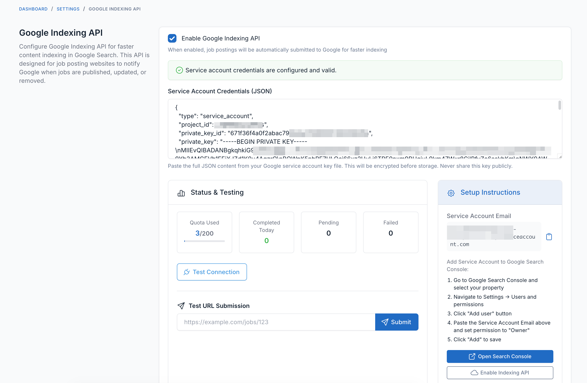

# FOB Google Indexing API

Google Indexing API integration for Botble CMS job posting websites. Enables real-time indexing notifications when job postings are published, updated, or deleted.

## Features

- **Immediate Indexing** - Jobs submitted to Google within seconds of publish/update
- **Full Lifecycle Support** - Handles publish, update, delete, and expire events
- **Encrypted Credentials** - Service account JSON stored securely in database
- **Quota Management** - Tracks daily usage (200/day limit) with automatic queue fallback
- **Extensible** - `ContentIndexingEvent` for custom content types

## Requirements

- Botble CMS 7.6+
- PHP 8.2+
- Google Cloud Project with Indexing API enabled
- Service account with Indexing API access

## Installation

1. Copy plugin to `platform/plugins/fob-google-indexing/`
2. Run: `php artisan cms:plugin:activate fob-google-indexing`
3. Run: `composer update`

## Google Cloud Setup

1. Go to [Google Cloud Console](https://console.cloud.google.com)
2. Create or select a project
3. Enable **Indexing API** (APIs & Services → Library)
4. Create service account (IAM & Admin → Service Accounts)
5. Create JSON key for the service account
6. Add service account email to Search Console as owner

## Configuration



1. Navigate to **Admin → Settings → Others → Google Indexing API**
2. Enable the plugin
3. Paste service account JSON credentials
4. Click Save
5. Test connection

## Usage

### Automatic Submission
Jobs are automatically submitted when:
- Published (URL_UPDATED)
- Updated (URL_UPDATED)
- Deleted (URL_DELETED)
- Expired (URL_DELETED)

### Artisan Commands

```bash
# Check status
php artisan google-indexing:manage --status

# View pending queue
php artisan google-indexing:manage --pending

# Submit specific URL
php artisan google-indexing:manage --url=https://example.com/jobs/123

# Delete URL from index
php artisan google-indexing:manage --delete-url=https://example.com/jobs/123

# Submit all published jobs
php artisan google-indexing:manage --all-jobs

# Clear pending/failed queues
php artisan google-indexing:manage --clear-pending
php artisan google-indexing:manage --clear-failed
```

## Quotas & Limits

| Limit | Value |
|-------|-------|
| Daily requests | 200 |
| Rate limit | 380/minute |
| Fallback | Queue for next day |

## Troubleshooting

**Connection Failed**
- Verify JSON credentials contain `client_email` and `private_key`
- Ensure service account added to Search Console

**Quota Exhausted**
- URLs automatically queued for next day
- Queue processed hourly when quota resets

## License

MIT
