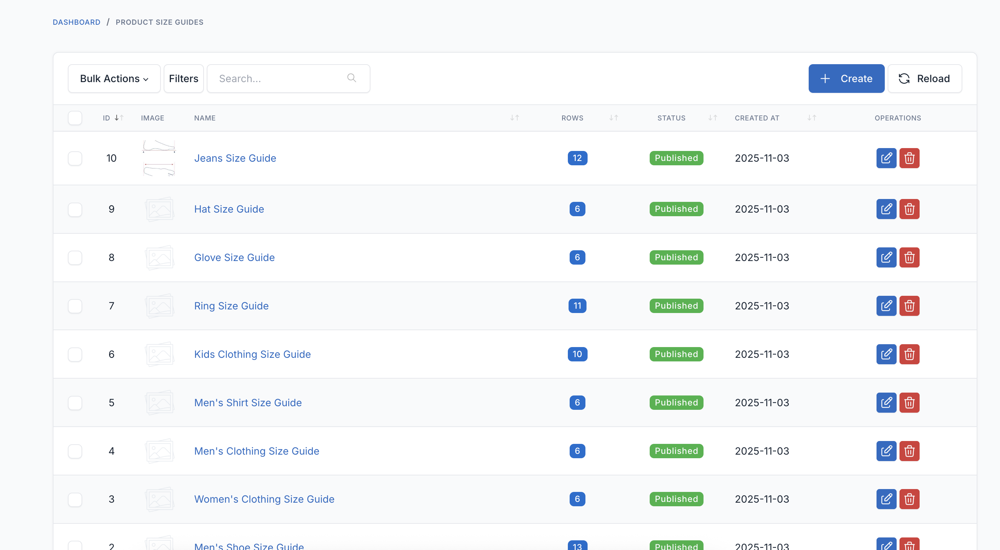
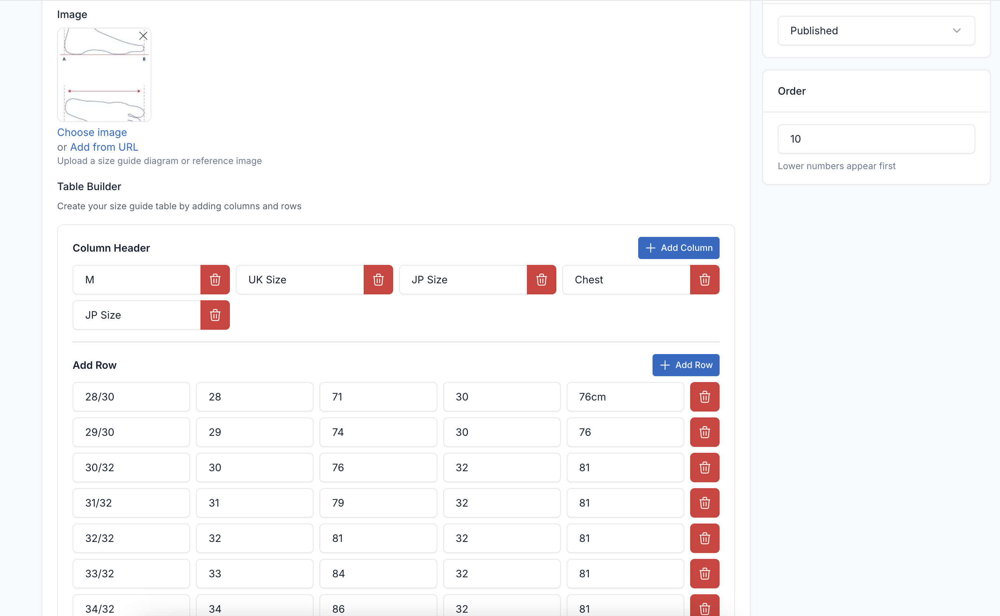
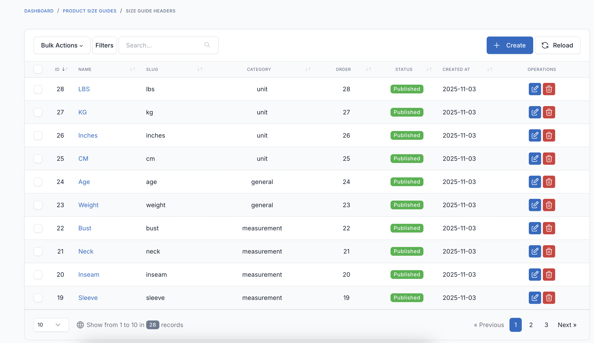
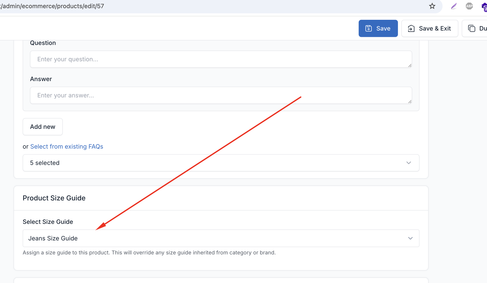
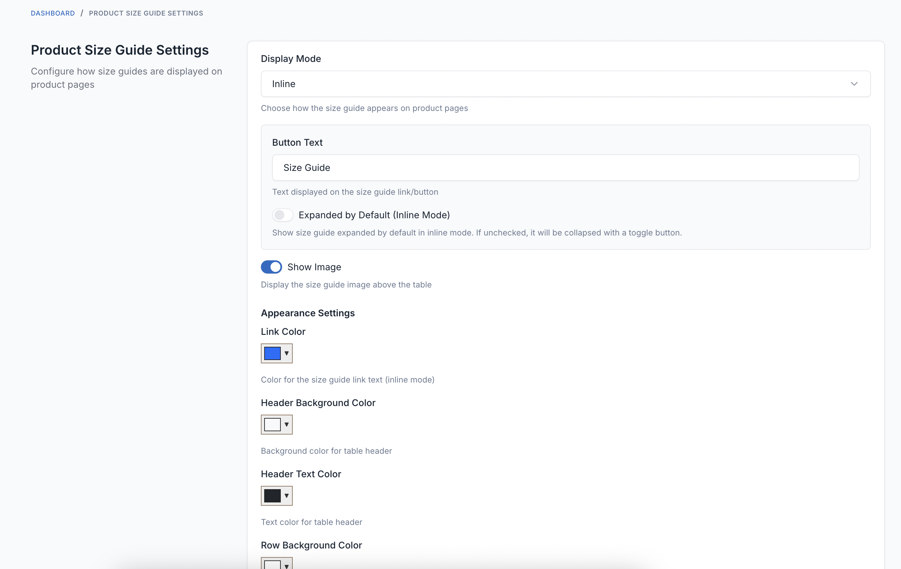
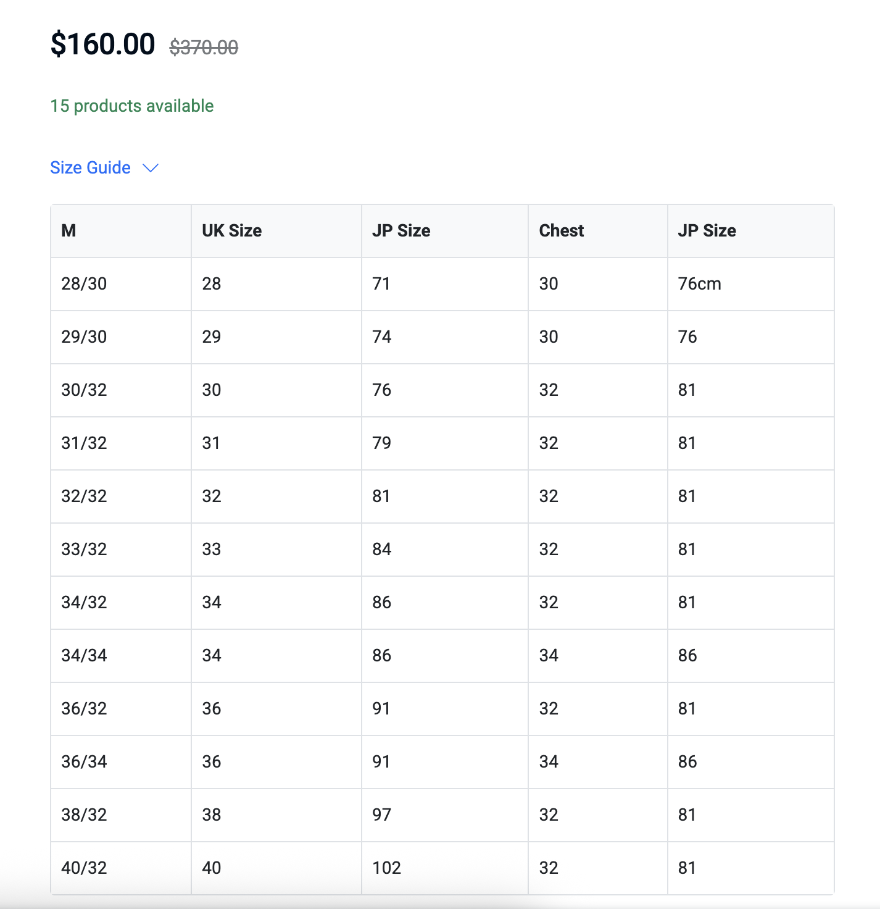

# FOB Product Size Guide

A professional product size guide plugin for Botble CMS that displays size charts with images and customizable tables on product pages. Perfect for clothing, footwear, and any products requiring size measurements.

## Requirements

- Botble core 7.5.0 or higher.
- PHP 8.2 or higher.
- Ecommerce plugin activated.

## Installation

### Install via Admin Panel

Go to the **Admin Panel** and click on the **Plugins** tab. Click on the "Add new" button, find the **FOB Product Size Guide** plugin and click on the "Install" button.

### Install manually

1. Download the plugin from the [Botble Marketplace](https://marketplace.botble.com/products/friendsofbotble/fob-product-size-guide).
2. Extract the downloaded file and upload the extracted folder to the `platform/plugins` directory.
3. Go to **Admin** > **Plugins** and click on the **Activate** button.

## Features

- **Flexible Table Builder**: Custom jQuery-based table builder with add/remove rows and columns
- **Image Support**: Upload size guide diagrams/images alongside tables
- **Multiple Assignment Methods**: Assign size guides to products, categories, or brands
- **Priority System**: Product-level > Category > Brand assignment hierarchy
- **Bootstrap 5 Compatible**: Works seamlessly with all Botble Bootstrap 5 themes
- **Tabler UI Admin**: Beautiful admin interface matching Botble's design
- **Responsive Display**: Mobile-friendly tables and modals
- **Conditional Display**: Show inline or in popup based on table size
- **Multi-language**: Full translation support
- **Theme Independent**: Works with all Botble themes

## Screenshots













## Usage

### Creating Size Guides

1. Go to **Admin** > **Product Size Guides** > **Size Guides**
2. Click **Create** button
3. Fill in the details:
   - **Name**: e.g., "Shoe Size Guide", "Men's Shirt Sizes"
   - **Description**: Optional description for internal reference
   - **Image**: Upload size guide diagram (optional)
   - **Table Builder**:
     - Click "Add Column" to add table headers (Size, Measurement, etc.)
     - Click "Add Row" to add size data
     - Use delete buttons to remove rows/columns
   - **Status**: Published/Draft
   - **Order**: Display priority (lower numbers first)
4. Click **Save**

### Table Builder

The custom table builder allows you to create flexible size charts:

- **Add Column**: Define table headers (e.g., "Size", "Foot Length", "EU Size", "US Size")
- **Add Row**: Add data for each size
- **Delete**: Remove any row or column
- **Flexible**: No limit on rows or columns

Example table structure:
```
| Size | Foot Length | EU Size |
|------|-------------|---------|
| 35   | 22cm        | 35      |
| 36   | 22.5cm      | 36      |
| 37   | 23cm        | 37      |
```

### Assigning Size Guides

#### Method 1: Direct Product Assignment

1. Edit any product
2. Scroll to **Product Size Guide** metabox
3. Select a size guide from the dropdown
4. Save the product

#### Method 2: Category Assignment

1. Go to **Products** > **Categories**
2. Edit a category
3. Scroll to **Product Size Guide** metabox
4. Select a size guide from the dropdown
5. All products in this category will inherit the size guide

#### Method 3: Brand Assignment

1. Go to **Products** > **Brands**
2. Edit a brand
3. Scroll to **Product Size Guide** metabox
4. Select a size guide from the dropdown
5. All products from this brand will inherit the size guide

#### Assignment Priority

If multiple size guides are assigned, the plugin uses this priority:
1. **Product-level** (highest priority)
2. **Category-level**
3. **Brand-level** (lowest priority)

### Global Settings

Navigate to **Admin** > **Product Size Guides** > **Settings** to configure:

**Display Settings**
- **Display Mode**: Choose how size guide appears
  - **Inline**: Shows directly on product page (best for short tables)
  - **Popup**: Opens in Bootstrap modal (best for long tables)
  - **Conditional**: Auto-decide based on table row count
- **Row Threshold**: For conditional mode, tables with more than X rows open in popup
- **Button Text**: Customize the "Size Guide" link/button text
- **Modal Title**: Customize popup title

**Appearance**
- **Show Image**: Display size guide image above table
- **Table Styling**: Choose Bootstrap table classes

### Frontend Display

The size guide appears on product detail pages after the product attributes section (size/color selectors).

**Inline Mode**: Table displays directly on the page
**Popup Mode**: "Size Guide" link opens Bootstrap 5 modal
**Conditional Mode**: Auto-switches based on table length

## Development

### Building Assets

The plugin uses webpack to compile SCSS and JavaScript files.

```bash
# Development build
npm run dev

# Production build
npm run prod

# Watch for changes
npm run watch

# Build specific plugin
npm run dev -- --mix-config=platform/plugins/fob-product-size-guide/webpack.mix.js
```

### Asset Structure

```
platform/plugins/fob-product-size-guide/
├── webpack.mix.js           # Webpack configuration
├── resources/
│   ├── sass/
│   │   ├── size-guide-admin.scss      # Admin styles (Tabler UI)
│   │   └── size-guide-frontend.scss   # Frontend styles (Bootstrap 5)
│   └── js/
│       ├── size-guide-admin.js        # Table builder JavaScript
│       └── size-guide-frontend.js     # Frontend modal/display
└── public/                  # Compiled assets (production)
    ├── css/
    │   ├── size-guide-admin.css
    │   └── size-guide-frontend.css
    └── js/
        ├── size-guide-admin.js
        └── size-guide-frontend.js
```

## Database Tables

### `fob_product_size_guides`
Stores size guide definitions with table data in JSON format.

| Column | Type | Description |
|--------|------|-------------|
| id | bigint | Primary key |
| name | string | Size guide name |
| description | text | Optional description |
| image | string | Path to uploaded image |
| table_headers | json | Array of column headers |
| table_rows | json | 2D array of table data |
| status | string | published/draft |
| order | integer | Display order |

### `fob_product_size_guide_relations`
Links size guides to products, categories, or brands.

| Column | Type | Description |
|--------|------|-------------|
| id | bigint | Primary key |
| size_guide_id | bigint | FK to fob_product_size_guides |
| reference_id | bigint | Product/Category/Brand ID |
| reference_type | string | 'product', 'category', or 'brand' |

## Sample Data

The plugin includes a seeder to create 10 sample size guides for testing:

```bash
php artisan db:seed --class="FriendsOfBotble\\ProductSizeGuide\\Database\\Seeders\\SizeGuideSeeder"
```

**Sample Size Guides Created:**
1. Women's Shoe Size Guide (11 sizes)
2. Men's Shoe Size Guide (13 sizes)
3. Women's Clothing Size Guide (6 sizes)
4. Men's Clothing Size Guide (6 sizes)
5. Men's Shirt Size Guide (6 sizes)
6. Kids Clothing Size Guide (10 ages)
7. Ring Size Guide (11 sizes)
8. Glove Size Guide (6 sizes)
9. Hat Size Guide (6 sizes)
10. Jeans Size Guide (12 sizes)

Each sample includes realistic size conversion data with multiple measurement columns.

## Troubleshooting

### Size Guide Not Showing

**Check:**
1. Size guide is assigned to the product, category, or brand
2. Size guide status is "Published"
3. Plugin is activated
4. Assets are compiled and published

### Table Not Displaying Correctly

**Check:**
1. Theme is using Bootstrap 5
2. Assets are published: `php artisan vendor:publish --tag=cms-public --force`
3. Clear cache: `php artisan cache:clear`
4. Check browser console for JavaScript errors

### Modal Not Opening

**Check:**
1. JavaScript file loaded correctly
2. Bootstrap 5 is loaded in theme
3. No JavaScript conflicts
4. Clear browser cache

## Browser Support

- Chrome/Edge (latest)
- Firefox (latest)
- Safari (latest)
- Mobile browsers (iOS Safari, Chrome)

## Contributing

Please see [CONTRIBUTING](CONTRIBUTING.md) for details.

## Bug Reports

If you discover a bug in this plugin, please [create an issue](https://github.com/FriendsOfBotble/fob-product-size-guide/issues).

## Security

If you discover any security related issues, please email friendsofbotble@gmail.com instead of using the issue tracker.

## Credits

- [Friends Of Botble](https://github.com/FriendsOfBotble)
- [All Contributors](../../contributors)

## License

The MIT License (MIT). Please see [License File](LICENSE) for more information.
